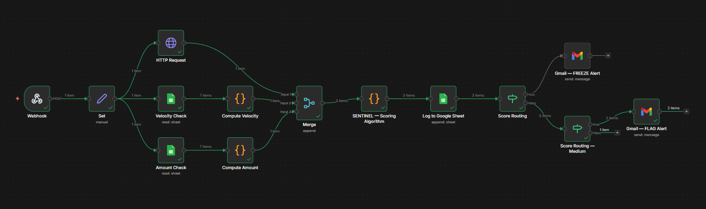
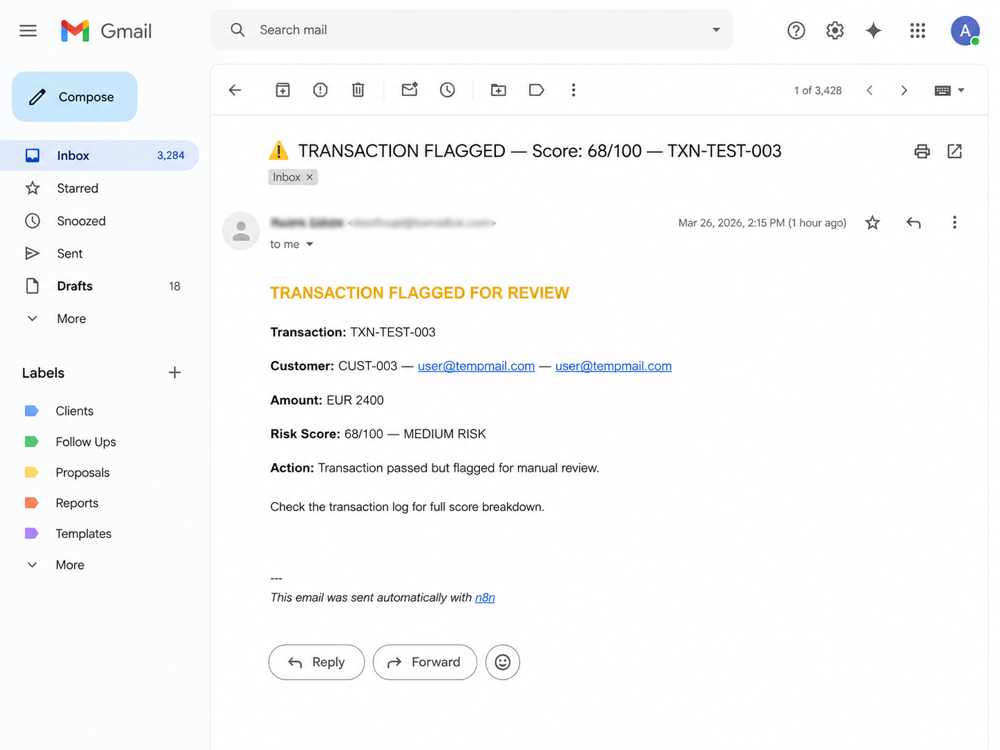

# AI Real-Time Fraud & Risk Mitigation Engine

An event-driven transaction fraud scoring engine built in n8n. Most fraud detection runs on a schedule - this fires the moment a payment transaction occurs. Every transaction is enriched with live geolocation and historical spend data, scored against a weighted risk algorithm, logged, and routed to the appropriate action within seconds. No manual review unless the score demands it.



## Architecture

```
Webhook (POST /transaction)
└── Set - extract transaction fields
    ├── [PARALLEL] HTTP Request - ip-api.com geolocation
    ├── [PARALLEL] Velocity Check (Google Sheets) - Compute Velocity
    └── [PARALLEL] Amount Check (Google Sheets) - Compute Amount
└── Merge (all 3 branches)
    └── SENTINEL - Scoring Algorithm (Code node)
        └── Log to Google Sheet
            ├── Score < 50   - PASS (no alert)
            ├── Score 50-74  - FLAG (low priority Gmail alert)
            └── Score >= 75  - FREEZE (urgent Gmail alert + full breakdown)
```

## Scoring Algorithm

The SENTINEL code node computes a weighted risk score between 0 and 100.

| Parameter | Weight | What it checks |
|---|---|---|
| Geo Mismatch | 30% | IP country vs billing country; VPN/proxy detection |
| Transaction Velocity | 25% | Number of transactions by this customer in the last 60 minutes |
| Amount Deviation | 20% | Current amount vs customer historical average |
| Time of Day | 15% | Transactions between 2am and 5am UTC flagged as high risk |
| Email Risk | 10% | Disposable or temporary email domain detection |

### Score Thresholds

| Score | Risk Level | Action |
|---|---|---|
| 0-49 | LOW | Transaction passes, no alert |
| 50-74 | MEDIUM | Transaction passes, low priority Gmail alert sent |
| 75-100 | HIGH | Transaction frozen, urgent Gmail alert with full score breakdown |

## Output



Every transaction is logged to the Google Sheet regardless of score. For MEDIUM risk, a low priority Gmail alert is sent with the score and key flags. For HIGH risk, an urgent alert fires with the full score breakdown by parameter so the ops team can act immediately.

## Enrichment Sources

**ip-api.com** - Free geolocation API, no key required
Endpoint: `http://ip-api.com/json/{ip_address}?fields=country,countryCode,proxy,hosting`
Returns: country, country code, VPN/proxy flag, hosting provider flag. Rate limit: 45 req/min.

**Google Sheets (Sentinel - Transaction Risk Log)** - Used for two parallel lookups:
- Velocity check: counts this customer's transactions in the last 60 minutes
- Amount deviation: calculates this customer's historical average transaction amount (default EUR 200 if no history)

## Webhook

Method: POST. Send requests to your n8n instance webhook URL. In test mode use the test URL shown in the Webhook node; in production use the production URL after publishing the workflow.

### Expected Payload

```json
{
  "transaction_id": "TXN-20260628-001",
  "timestamp": "2026-06-28T03:15:00Z",
  "customer_id": "CUST-4821",
  "customer_email": "felix.braun@spendly.com",
  "amount_eur": 2400.00,
  "ip_address": "196.245.163.45",
  "billing_country": "DE",
  "card_last4": "4821"
}
```

## Test Scenarios

### Test 1 - LOW RISK (expected: PASS, no email)
```json
{
  "transaction_id": "TXN-TEST-001",
  "timestamp": "2026-06-28T10:30:00Z",
  "customer_id": "CUST-001",
  "customer_email": "jonas.klein@spendly.com",
  "amount_eur": 85.00,
  "ip_address": "217.110.45.22",
  "billing_country": "DE",
  "card_last4": "1234"
}
```

### Test 2 - MEDIUM RISK (expected: FLAG, low priority email)
```json
{
  "transaction_id": "TXN-TEST-002",
  "timestamp": "2026-06-28T23:45:00Z",
  "customer_id": "CUST-002",
  "customer_email": "marcus.weber@gmail.com",
  "amount_eur": 850.00,
  "ip_address": "41.203.65.12",
  "billing_country": "DE",
  "card_last4": "5678"
}
```

### Test 3 - HIGH RISK (expected: FREEZE, urgent email with breakdown)
```json
{
  "transaction_id": "TXN-TEST-003",
  "timestamp": "2026-06-28T03:15:00Z",
  "customer_id": "CUST-003",
  "customer_email": "user@tempmail.com",
  "amount_eur": 2400.00,
  "ip_address": "196.245.163.45",
  "billing_country": "DE",
  "card_last4": "9999"
}
```

Send via [Hoppscotch](https://hoppscotch.io) or Postman as a POST request with `Content-Type: application/json`.

## Google Sheet

File: `Sentinel - Transaction Risk Log`

Column headers required in Row 1:

Transaction ID | Timestamp | Customer ID | Customer Email | Amount (EUR) | IP Address | IP Country | Billing Country | Geo Mismatch Score | Velocity Score | Amount Deviation Score | Time of Day Score | Final Risk Score | Risk Level | Action Taken

## Credentials Required

| Node | Credential type |
|---|---|
| Velocity Check, Amount Check, Log to Google Sheet | Google Sheets OAuth2 |
| Gmail FREEZE Alert, Gmail FLAG Alert | Gmail OAuth2 |

## How to Run

**Test mode:**
1. Open the workflow in n8n
2. Click Listen for test event on the Webhook node
3. Send a POST request to your n8n test webhook URL
4. Watch execution live in the editor

**Production mode:**
1. Click Publish (top right)
2. Send POST requests to your n8n production webhook URL
3. Workflow fires automatically on every transaction

## Notes

- Velocity and Amount Check nodes read all rows and filter in the Compute nodes, handles empty sheets gracefully
- After the Log node, field names map to column headers; Score Routing and Gmail nodes reference column header names
- ip-api.com free tier: 45 requests per minute. For higher volume consider a paid plan or caching layer

---

Built by [Nikhil Roy](https://nikhilroy.lovable.app), Berlin
