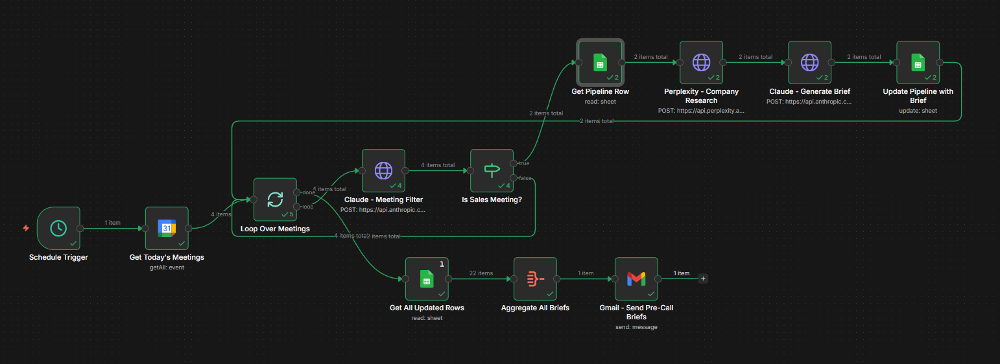
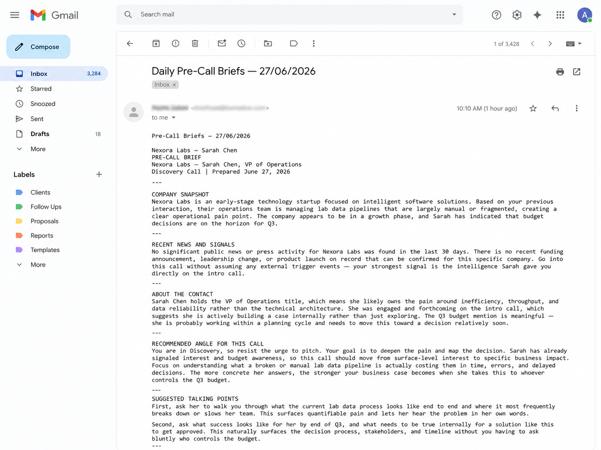

# Pre-Call Brief Generator

An n8n workflow that runs every morning at 8am, checks your Google Calendar for client and sales meetings that day, researches each company, and emails you a concise pre-call brief before you pick up the phone.

## What It Does

Most salespeople walk into calls having done zero research, or having spent 20 minutes on LinkedIn 10 minutes before. This workflow does the research automatically overnight and delivers everything you need in one email before the day starts.

Every morning at 8am it:

1. Pulls today's meetings from Google Calendar
2. Filters for sales and client meetings using Claude — personal events are automatically skipped
3. Extracts the company name from the meeting title using Claude
4. Looks up the company in your Google Sheets CRM
5. Researches the company and contact via Perplexity (last 30 days of news and background)
6. Generates a structured brief via Claude covering company snapshot, recent signals, contact background, recommended angle, talking points, and likely objections
7. Writes the brief back to the Brief column in your sheet
8. Emails a single digest with all briefs for the day, formatted in HTML

## Workflow Architecture

Schedule Trigger (8am daily)
    └── Google Calendar (fetch today's events)
            └── Loop Over Items (one meeting at a time)
                    └── Claude (is this a client or sales meeting? YES or NO)
                            ├── [NO]  Skip, back to loop
                            └── [YES] Claude (extract company name from title)
                                    └── Google Sheets (look up company in CRM)
                                            └── Perplexity (research company and contact)
                                                    └── Claude (generate structured brief)
                                                            └── Google Sheets (write brief to CRM)
                                                                    └── Back to loop
    └── [done] Get rows from Sheet (execute once)
                └── Aggregate
                        └── Gmail (one email with all briefs)

Key design decisions:

- Claude classifies each meeting before any research is done, avoiding wasted API calls on personal events
- Company name is extracted intelligently from meeting titles so exact CRM matching is not required
- One email per day regardless of how many meetings, compiled after the loop finishes
- Brief is written back to the CRM sheet so it persists for future reference

## Stack

| Tool | Purpose |
|---|---|
| n8n (self-hosted) | Workflow orchestration |
| Google Calendar | Meeting source |
| Google Sheets | CRM and pipeline data |
| Perplexity API (sonar model) | Live company and contact research |
| Anthropic Claude (claude-sonnet-4-6) | Meeting classification, name extraction, brief generation |
| Gmail | Email delivery |

## Setup

### Prerequisites

- n8n instance running (local or cloud)
- Anthropic API key
- Perplexity API key
- Google OAuth credentials connected in n8n for Calendar, Sheets, and Gmail

### Installation

1. Download Pre-Call Brief Generator.json
2. In n8n: Workflows → Import from file
3. Connect your credentials in each node (Calendar, Sheets, Gmail nodes will prompt you)
4. Add your Anthropic and Perplexity API keys to the HTTP Request nodes (x-api-key header for Anthropic, Authorization: Bearer for Perplexity)

### Google Sheet Format

Your Master Sheet needs at minimum these columns:

- Company Name — used for matching against Claude's extracted company name
- Contact Name
- Contact Title
- Deal Stage
- Notes
- Brief — written by the workflow after each run

### Schedule

Triggers daily at 8:00 AM via cron. Adjust in the Schedule Trigger node if needed.

## How Company Matching Works

Claude reads the meeting title (e.g. "Product Demo — Nexora Labs") and returns the company name in a structured format. That name is then used to filter your CRM sheet. If Claude cannot extract a name, it falls back to the raw meeting title.

## Output

A single HTML email delivered to your inbox each morning with one section per client meeting — company name, contact, and the full brief in plain prose.

The brief is also written back to your CRM sheet for future reference.

## Author

Nikhil Roy, Berlin-based operator with a background in project management, business development, and AI workflow automation.

Portfolio: https://nikhilroy.lovable.app
