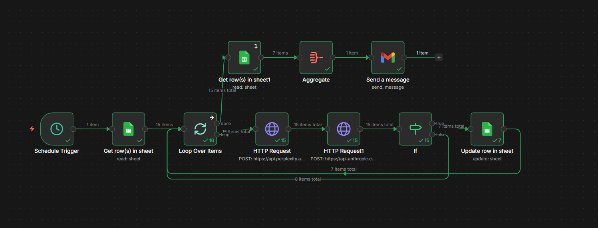

# Sales Signal Monitor

An automated B2B sales intelligence workflow built with n8n. Monitors a target company list, queries real-time news via Perplexity AI, qualifies each signal using Claude (Anthropic), updates a Google Sheet with results, and delivers a compiled email digest, all on a schedule with no manual input required.

## What It Does

Most B2B sales teams track target accounts manually, checking LinkedIn, Google News, or Crunchbase one company at a time. This workflow automates that entirely.

Every time it runs, it:

1. Reads a target company list from a Google Sheet
2. Loops through each company individually
3. Queries Perplexity AI for recent news and developments
4. Passes the result to Claude (claude-sonnet-4-6) to determine whether it represents a meaningful B2B sales signal
5. If a signal is found, writes a one-sentence opportunity summary back to the sheet
6. Once all companies are processed, sends a single compiled email digest with every actionable signal

## Workflow Architecture

Schedule Trigger
└── Get rows from Sheet (company list)
        └── Loop Over Items (one company at a time)
                ├── [loop] HTTP Request → Perplexity AI (fetch news)
                │           └── HTTP Request → Anthropic Claude (qualify signal)
                │                       └── If (signal or no signal?)
                │                               ├── [true]  Update row in Sheet
                │                               └── [false] Skip, continue loop
                └── [done] Get rows from Sheet (execute once)
                            └── Aggregate (collapse all rows into one item)
                                    └── Send email via Gmail (one digest)

Key design decisions:

- Batch size of 1 so each company is checked individually and errors are isolated
- Claude returns either a one-sentence opportunity or exactly NO_SIGNAL, easy to filter
- Get rows node set to Execute Once to prevent the email firing multiple times per loop
- Aggregate node collapses all rows before Gmail so only one email is sent per run

## Stack

| Tool | Purpose |
|---|---|
| n8n (self-hosted) | Workflow orchestration |
| Perplexity AI | Real-time web search and news retrieval |
| Anthropic Claude (claude-sonnet-4-6) | Signal qualification and summarisation |
| Google Sheets | Target company list and signal storage |
| Gmail | Email digest delivery |

## Setup

### Prerequisites

- n8n Community Edition (self-hosted)
- Perplexity API key
- Anthropic API key
- Google account (Sheets + Gmail)

### Installation

1. Clone this repo
2. Import Sales Signal Monitor.json into your n8n instance via Workflows → Import
3. Configure credentials in n8n:
   - Perplexity: HTTP Header Auth (Authorization: Bearer YOUR_KEY)
   - Anthropic: HTTP Header Auth (x-api-key: YOUR_KEY, anthropic-version: 2023-06-01)
   - Google Sheets: OAuth2
   - Gmail: OAuth2
4. Create a Google Sheet with columns: Company Name, Status, AOS, Link, News & Leverage, Last Updated
5. Update the Google Sheet ID in the workflow nodes
6. Set the Schedule Trigger to your preferred cadence
7. Activate the workflow

## Claude Prompt

You are a B2B sales analyst. Based on this news about [Perplexity output], is this a meaningful sales signal for a B2B software company? If YES, respond with only one clear sentence explaining the opportunity, starting with the company name. If NO, respond with exactly: NO_SIGNAL

## Target Company List

| Company | Sector |
|---|---|
| 1KOMMA5° | Residential energy management |
| Envelio | Grid digitalisation for DSOs |
| gridX | Energy management for utilities and EVs |
| Twaice | Battery analytics and predictive maintenance |
| Fyld | AI field operations for utilities |
| Kauz | Conversational AI for B2B |
| Ampere.energy | AI-driven energy trading and forecasting |
| Nodes & Links | AI project intelligence for infrastructure |

## Author

Nikhil Roy, Berlin-based operator with a background in project management, business development, and tech and AI workflow automation.

Portfolio: https://nikhilroy.lovable.app
